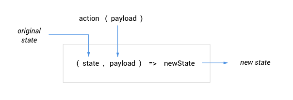
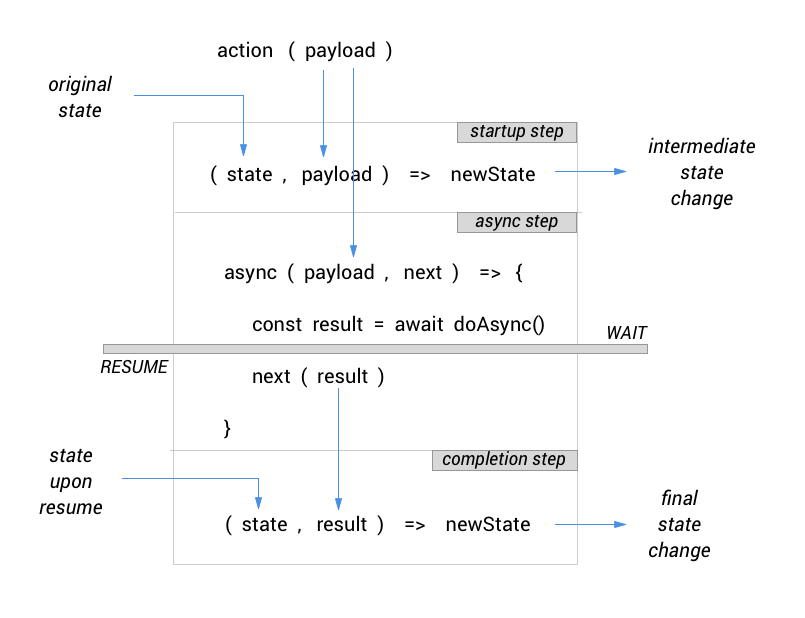

# Reactor Library

Reactor Library simplifies React/Redux development, minimizing the boilerplate required to get the job done.

Here are things that Reactor Library can help you work with:

- [Functional Components](#functional-components) (state, _effects_)
- [Declarative Routing](#declarative-routing)
- [Simplified App State](#simplified-app-state) (fresh take on Redux)
- [Context](#context)

To install:
```
npm install @reactorlib/core --save
```

# Functional Components

The use of Reactor Library's _higher order components_ (HOCs) encourage the use of _functional components_ (in constrast to _class components_), which are enhanced by injecting data or additional functionality into them. You can, however, also use Reactor Library with your existing class based components.

**Note on React Hooks:** At the time of this writing, the React Hooks API has not been officially released yet. Developers who choose to jump to pure functional components right away will find Reactor Library's HOCs useful while waiting for the Hooks version.

## Enhancing Components by Composition

### `compose`

This function stacks multiple HOCs and returns a single HOC with the combined effect of all the stacked HOCs.

```typescript
compose(...functions)(Component)
```

This applies the HOCs passed as arguments, from **right to left** (just like how function nesting works).

Using this format makes stacked HOCs more readable and easier to rearrange, especially since typical HOCs are _parameterized_, i.e. they are actually functions that take some argument(s) and return the actual HOC.

For example:
```javascript
const MyComponent = compose(
  withStore({ session }),
  withStyles(styles)
)(BaseComponent);
```

The above is just a better way of presenting this:
```javascript
const MyComponent = withStore({ session })(withStyles(styles)(BaseComponent))
```

## Adding State to Functional Components

To circumvent the _stateless_ nature of functional components, where all you define are props, you would need to inject internal state into the component as props.

### `withState`

This HOC provides state and makes it available within the component function as an additional prop. 

```typescript
withState(state: string, initialValue: any)
```

The injected prop is just like a regular prop, except that it also behaves as an internal state, i.e. changing its value will re-render the component. For this reason, we will refer to it as a _state prop_.

Apart from the state prop itself, `withState` also injects the corresponding updater function for the state. This is the equivalent of `this.setState()` in class components. In this case it is named after the state prop, e.g. for state prop called `email`, the updater function is called `setEmail()`. Since it is also injected, we can refer to it as _updater prop_.

Example usage:
```javascript
compose(
  withState('email', ''),
  withState('password', '')
)(LoginForm);
```

In this example, within `LoginForm` the state props and their corresponding updaters are accessible as follows:
```javascript
const LoginForm = ({ email, setEmail, password, setPassword }) => {
  // Define component here
}
```

## Effects as Alternative to Lifecycle Methods

Functional components by nature do not have lifecycle methods. However, we can still implement routines that need to run whenever the component renders, mounts or unmounts using _effects_ and _cleanup_.

### `withEffect`

This HOC injects a function into the component such that it gets executed whenever the component renders, or only when it mounts. 

```typescript
withEffect(effect: Function, onlyOnMount?: boolean)
```

This allows you to run code that would otherwise be unsafe to do inside the main body of the function component, such as state mutations, timers, async operations and similar side effects.

The `effect` argument is a function of this form:
```javascript
props => { doSomething() }
```
Note that `withEffect` passes the (optional) `props` of the component to the function.

When `onlyOnMount` is set to `true`, this is the direct alternative to `componentDidMount()`. Otherwise, it behaves like running the effect inside both `componentDidMount()` and `componentDidUpdate()`.

### `withCleanup`

This HOC works similar to `withEffect` except that it gets executed when the component unmounts. 

```typescript
withCleanup(cleanup: Function)
```

This allows you to perform necessary teardown code, such as cancelling ongoing async operations and clearing timers that would otherwise cause errors when their callback fires while the component is already gone.

The `cleanup` argument is a function of this form:
```javascript
props => { doSomething() }
```
Note that `withCleanup` passes the (optional) `props` of the component to the function.

### Example usage of effects and cleanup

```javascript
const Timer = compose(
  withEffect(doFetchConfig, true),
  withEffect(updateTimer),
  withCleanup(clearTimer)
)(BaseTimer);
```

In this example, the combination of effects and cleaup will have the net effect of performing an async `doFetchConfig(props)` when `<Timer>` mounts, calling `updateTimer(props)` on mount and every re-render thereafter, then finally `clearTimer(props)` once the component unmounts.


# Declarative Routing

To enable routing, the app would have a `<Router>` instance at a top-level component, ideally the `<App>`. You will only need to have **one** such instance for the entire app. This is provided by the standard `react-router`, not Reactor Library. You can check the `react-router` [official documentation](https://reacttraining.com/react-router/core/api/Router) for details.

What Reactor Library does provide is simple, declarative routing that works with  `react-router`.

## The Router Outlet

Admittedly inspired by Angular's approach to routing, Reactor Library provides a _router outlet_ component that is a convenient drop-in replacement for `react-router`'s combination of `<Switch>`, `<Route>` and `<Redirect>` components, that adds a couple of neat features as well.

### `<RouterOutlet>`

Place this component wherever you need routed views.

```html
<RouterOutlet routes={routes} />
```

Routing can apply to any level component, so you can place a `<RouterOutlet>` virtually anywhere in the component tree.

## Defining Routes

We use this format when declaring routes:
```javascript
  const routes = [
    {
      path: '/login',
      component: LoginPage
    },
    {
      path: '/default',
      component: DefaultPage
    },
    {
      path: '/',
      exact: true,
      redirectTo: '/default'
    },
    {
      component: NotFound
    }
  ];
```

These are the common cases for routes:

- Both `path` and `component` are defined in the route spec. This is straightforward routing.
- No `path` is specified, which means this is the default route if none of the preceding routes matched.
- If `exact` is set to `true`, the `path` has to match exactly.
- If `redirectTo` path is specified instead of `component`, this is a straightforward redirection.

## Protected Routes

```javascript
    {
      path: '/default',
      component: DefaultPage,
      canEnter: isAuthenticated,
      fallback: '/login',
    },
```

If a `canEnter` guard function is defined, the router will only activate the matched route if this function evaluates to `true`. Otherwise, it will route to the `fallback` route. This is useful for apps that require user login to access specific features.

## Routing to Lazy Loaded Components

For optimization, feature components can be _lazy loaded_, i.e. they are only fetched by the browser if and when they are required by the app. This technique is also called _code splitting_.

Instead of the normal `import`, use **React Lazy** to import lazy-loaded components.

```javascript
import React, { lazy } from 'react';

const WelcomePage = lazy(() => import('../welcome/WelcomePage'));
```

The `<RouterOutlet>` supports routing to such lazy-loaded components by using React Suspense internally.

For more information on React Lazy and Suspense, check out the [official documentation](https://reactjs.org/docs/code-splitting.html).


# Simplified App State

Reactor Library makes it easy to manage application state. All you need to know about are these 3 key things:
- **Store**: This is the single place where the entire state of your application is kept.
- **Entities**: These are pieces of the app state, each representing a specific area of concern or functionality.
- **Actions**: These are functions that your components can invoke to trigger some change in the app state. These also reside in the store.

## Creating Entities

### `createEntity`

This function, as the name suggests, is used to create an entity.

```javascript
createEntity(reactions: Object, initialState: any)
```

To create an entity, we need to describe the state changes that occur within the entity in response to actions, which we'll refer to as its _reactions_.

The `reactions` argument is a mapping of action names against corresponding reactions. Note that **the mapping is not meant to define the actual action functions**.

Each reaction is described in either of 2 forms:

#### Simple Reaction

```javascript
action: (state, payload) => newState
```

where `action` corresponds to the name of an action, while `payload` (optional) is any **single argument** that the entity expects you to pass to the action. All this really means is, when  `action(payload)` is invoked, the entity applies certain logic to change its state from  `state` to  `newState`.

This diagram illustrates the flow of data through a simple reaction:



#### Async Reaction

```javascript
action: [
  (state, payload) => newState,
  async (payload, next) => { 
    const result = await doSomethingAsync();
    next(result); 
  },
  (state, result) => newState
]
```

This is what you use if you need the reaction to include some sort of _side effects_ beyond changing state. The array consists of 3 items that correspond to steps of the reaction:
1. The _**startup step**_ where any preparatory state change can be made, e.g. setting a 'loading' or 'wait' flag.
2. The _**async step**_ where the entity performs the side effect in the form of an async operation, e.g. fetching data from the server. It waits until the async operation completes, before calling the next step.
3. The _**completion step**_ where the final state change is made, normally based on result of the preceding async step.

This diagram illustrates how data flows throughout the 3 steps of the async reaction:



The startup step is actually optional, so sometimes you would only need to use this 2-step form:

```javascript
action: [
  async (payload, next) => { 
    const result = await doSomethingAsync();
    next(result); 
  },
  (state, result) => newState
]
```

### Do Not Mutate the State

**IMPORTANT**: In defining your entity's reactions, the React golden rule of not mutating the component state also applies to the application state. So if your entity's state is of object or array type, always make sure to return a fresh object or array.

### Example Usage

Here is an example of a complete entity with both simple and async reactions:

```javascript
const initialState = { auth: null, error: false };

const session = createEntity(
  {
    login: [
      ({ username, password }, next) => {
        login(username, password)
          .then(response => next(response))
          .catch(error => next({ error }));
      },
      (state, { auth = null, error = false }) => ({ ...state, auth, error }),
    ],
    logout: state => ({ ...state, auth: null }),
  },
  initialState
);

export default session;
```

### Multiple Entities Reacting to the Same Action

It is absolutely normal for different entities to have reaction to the same action. In non-production mode, Reactor Library will output a console warning just to make sure that such duplicate is indeed intentional.

## Setting Up the Store

There can only be **one** store, and this should be injected into a top-level component, ideally the `<App>`.

### `withStore`

This HOC creates the single store, puts entities into it, and designates a top-level component as the provider/owner of the store.

```typescript
withStore(entities: Object)
```

Here the `entities` argument is a mapping of entity names against the actual entity objects created using `createEntity()`. This mapping is important because we access entities from the store using the names assigned here.

### Example Usage
If we are to use the `session` entity we created in the previous example, together with another called `user`, here's how we do it:
```javascript
import session from './store/session';
import user from './store/user';

const App = () => (
  <Router>
    <Shell />
  </Router>
);

export default withStore({ session, user })(App);
```

## Adding Lazy-Loaded Entities to Store

If you use code splitting, a lazy-loaded module can have its own _feature store_ containing feature-specific entities.  As there can only be a single store in the app, Reactor Library provides a simple way to dynamically merge lazy-loaded feature stores into the main store.

### `withFeatureStore`

This HOC adds the lazy-loaded entities coming from a feature store into the main store. It automatically does this store-merging as soon as the HOC's target component's module is loaded. For this reason, this should only be used on lazy-loaded components.

```typescript
withFeatureStore(entities: Object)
```
This has exactly the same signature as `withStore` and the same usage pattern.

## Importing Props from Store

Components are able to read the application state by importing entities from the store. They can also change the app state by importing actions from the store.

### `getPropsFromStore`

This HOC imports entities and/or actions from the store, and injects them to a component as additional props. 

```typescript
getPropsFromStore(entities?: Array<string>, actions?: Array<string>)
```
Here, `entities` is a list of entity names, and `actions` is a list of action names. Either or both can be specified. 

Imported entities are injected as _state props_, similar to how `withState` does. This means that whenever any of these imported entities change, the component will re-render.

Imported actions are injected as function props that you can directly invoke inside your component's _effects_ or event handlers.

**Where do we define these action functions?** We don't. The store creates these for us, based on all the action names we mapped to the _reactions_ when creating our entities with `createEntity`. Therefore, if an action is not mapped by any of the entities, the store would not provide any corresponding action function.

### Example Usage
Continuing the previous examples, we import the `session` and  `user` entities from the store, together with the `login()` action:
```javascript
const Login = ({ session, user, login }) => (
  <>
  {session.auth !== null
    ? <div>Welcome back, {user}!</div>
    : <LoginForm onSubmit={login} />
  }
  </>
);

export default getPropsFromStore(['session', 'user'], ['login'])(Login);
```
