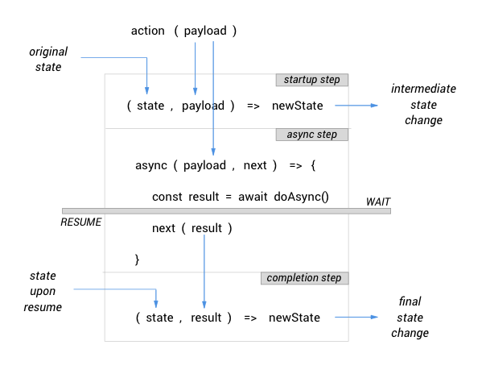

# Simplified App State

Reactor Library makes it easy to manage application state. All you need to know about are these 3 key things:
- **Store**: This is the single place where the entire state of your application is kept.
- **Entities**: These are pieces of the app state, each representing a specific area of concern or functionality.
- **Actions**: These are functions that your components can invoke to trigger some change in the app state. These also reside in the store.

## Creating Entities

### `createEntity`

This function, as the name suggests, is used to create an entity.

```javascript
createEntity(reactions: Object, initialState: any)
```

To create an entity, we need to describe the state changes that occur within the entity in response to actions, which we'll refer to as its _reactions_.

The `reactions` argument is a mapping of action names against corresponding reactions. Note that **the mapping is not meant to define the actual action functions**.

Each reaction is described in either of 2 forms:

#### Simple Reaction

```javascript
action: (state, payload) => newState
```

where `action` corresponds to the name of an action, while `payload` (optional) is any **single argument** that the entity expects you to pass to the action. All this really means is, when  `action(payload)` is invoked, the entity applies certain logic to change its state from  `state` to  `newState`.

This diagram illustrates the flow of data through a simple reaction:


#### Async Reaction

```javascript
action: [
  (state, payload) => newState,
  async (payload, next) => { 
    const result = await doSomethingAsync();
    next(result); 
  },
  (state, result) => newState
]
```

This is what you use if you need the reaction to include some sort of _side effects_ beyond changing state. The array consists of 3 items that correspond to steps of the reaction:
1. The _**startup step**_ where any preparatory state change can be made, e.g. setting a 'loading' or 'wait' flag.
2. The _**async step**_ where the entity performs the side effect in the form of an async operation, e.g. fetching data from the server. It waits until the async operation completes, before calling the next step.
3. The _**completion step**_ where the final state change is made, normally based on result of the preceding async step.

This diagram illustrates how data flows throughout the 3 steps of the async reaction:



The startup step is actually optional, so sometimes you would only need to use this 2-step form:

```javascript
action: [
  async (payload, next) => { 
    const result = await doSomethingAsync();
    next(result); 
  },
  (state, result) => newState
]
```

### Do Not Mutate the State

**IMPORTANT**: In defining your entity's reactions, the React golden rule of not mutating the component state also applies to the application state. So if your entity's state is of object or array type, always make sure to return a fresh object or array.

### Example Usage

Here is an example of a complete entity with both simple and async reactions:

```javascript
const initialState = { auth: null, error: false };

const session = createEntity(
  {
    login: [
      ({ username, password }, next) => {
        login(username, password)
          .then(response => next(response))
          .catch(error => next({ error }));
      },
      (state, { auth = null, error = false }) => ({ ...state, auth, error }),
    ],
    logout: state => ({ ...state, auth: null }),
  },
  initialState
);

export default session;
```

### Multiple Entities Reacting to the Same Action

It is absolutely normal for different entities to have reaction to the same action. In non-production mode, Reactor Library will output a console warning just to make sure that such duplicate is indeed intentional.

## Setting Up the Store

There can only be **one** store, and this should be injected into a top-level component, ideally the `<App>`.

### `withStore`

This HOC creates the single store, puts entities into it, and designates a top-level component as the provider/owner of the store.

```typescript
withStore(entities: Object)
```

Here the `entities` argument is a mapping of entity names against the actual entity objects created using `createEntity()`. This mapping is important because we access entities from the store using the names assigned here.

### Example Usage
If we are to use the `session` entity we created in the previous example, together with another called `user`, here's how we do it:
```javascript
import session from './store/session';
import user from './store/user';

const App = () => (
  <Router>
    <Shell />
  </Router>
);

export default withStore({ session, user })(App);
```

## Adding Lazy-Loaded Entities to Store

If you use code splitting, a lazy-loaded module can have its own _feature store_ containing feature-specific entities.  As there can only be a single store in the app, Reactor Library provides a simple way to dynamically merge lazy-loaded feature stores into the main store.

### `withFeatureStore`

This HOC adds the lazy-loaded entities coming from a feature store into the main store. It automatically does this store-merging as soon as the HOC's target component's module is loaded. For this reason, this should only be used on lazy-loaded components.

```typescript
withFeatureStore(entities: Object)
```
This has exactly the same signature as `withStore` and the same usage pattern.

## Importing Props from Store

Components are able to read the application state by importing entities from the store. They can also change the app state by importing actions from the store.

### `getPropsFromStore`

This HOC imports entities and/or actions from the store, and injects them to a component as additional props. 

```typescript
getPropsFromStore(entities?: Array<string>, actions?: Array<string>)
```
Here, `entities` is a list of entity names, and `actions` is a list of action names. Either or both can be specified. 

Imported entities are injected as _state props_, similar to how `withState` does. This means that whenever any of these imported entities change, the component will re-render.

Imported actions are injected as function props that you can directly invoke inside your component's _effects_ or event handlers.

**Where do we define these action functions?** We don't. The store creates these for us, based on all the action names we mapped to the _reactions_ when creating our entities with `createEntity`. Therefore, if an action is not mapped by any of the entities, the store would not provide any corresponding action function.

### Example Usage
Continuing the previous examples, we import the `session` and  `user` entities from the store, together with the `login()` action:
```javascript
const Login = ({ session, user, login }) => (
  <>
  {session.auth !== null
    ? <div>Welcome back, {user}!</div>
    : <LoginForm onSubmit={login} />
  }
  </>
);

export default getPropsFromStore(['session', 'user'], ['login'])(Login);
```

## Advanced Usage

Under the hood, Reactor Library's simplified app state management is powered by Redux. So this means that for more advanced use-cases, you can still tap the full capabilities of Redux as needed.

To learn more about Redux, take a look at their [official documentation here](https://redux.js.org/introduction/getting-started).

[< Table of Contents](../README.md#reactor-library)
